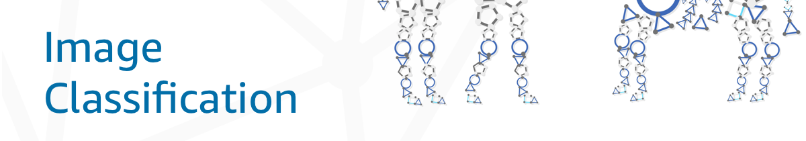

# Open Neural Network eXchange (ONNX) Model Zoo
The ONNX Model Zoo is a collection of pre-trained models for state of the art works in deep learning. Models are available in the ONNX protobuf format. Where available and supported, the models are also available in the MXNet Model Server (MMS) archive format. Accompanying each model are [Jupyter](http://jupyter.org) notebooks for model training and running inference with the trained model. The notebooks are written in Python using [MXNet](http://mxnet.incubator.apache.org) as a backend and include links to the training dataset as well as references to the original paper that describes the model architecture.

## Models

<!--Using placeholder images for now! -->

This collection of models take images as input, then classifies the major objects in the images into a set of predefined classes.

These models detect the presence of faces in images. Some more popular models are used for detection of celebrity faces, gender, age, and emotions.

<!--
The model takes images as input and detects/recognizes human faces in the image

| | | |
|-|-|-|
|<b>ArcFace</b>  *description*|||
|[ONNX model]()&nbsp; &nbsp; &nbsp; &nbsp; &nbsp; &nbsp; &nbsp; &nbsp; &nbsp; &nbsp; &nbsp; &nbsp; &nbsp; &nbsp; &nbsp; &nbsp; &nbsp; &nbsp; &nbsp; &nbsp; &nbsp;  [MMS archive]()  [Example notebook]() [Reference](https://arxiv.org/abs/1801.07698)  [Training notebook]()  [Dataset]() |
-->

Semantic segmentation models will identify multiple classes of objects in an image and provide information on the areas of the image that object was detected.

## Model Serving with MMS
Many of the models in this model zoo can be served with [MXNet Model Server](https://github.com/awslabs/mxnet-model-server) (MMS). MMS is a flexible and easy tool to serve deep learning models by providing a REST API with an inference end point. Supported ONNX models such as those converted from Chainer, CNTK, MXNet, and PyTorch can be served with MMS. To learn about ONNX model serving with MMS, refer to the [MMS ONNX documentation](https://github.com/awslabs/mxnet-model-server/blob/master/docs/export_from_onnx.md).

## Model Visualization
You can see visualizations of each model's network architecture by using [Netron](https://lutzroeder.github.io/Netron).

## Contributions
Do you want to contribute a model? Check out the list of [backlog models](backlogs.md) <!-- should definitely pick a different name for this-->to get started. Also refer to the [contribution guidelines](contribute.md) before submitting a model.
