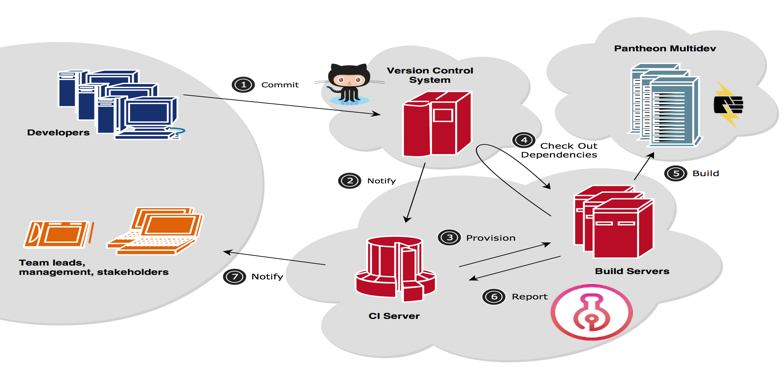
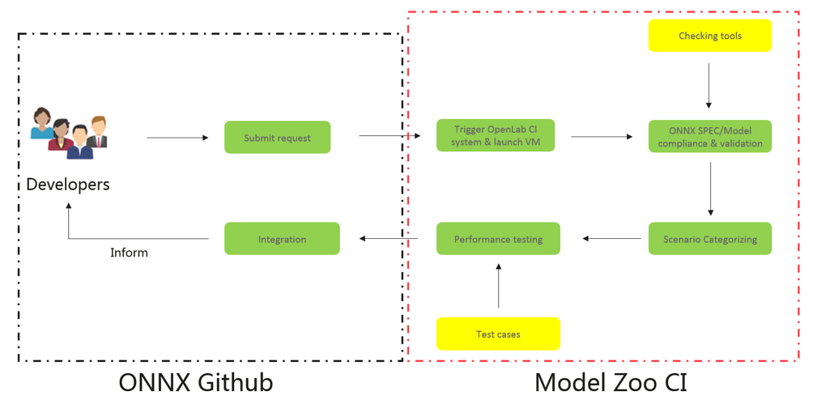

# ONNX Model Zoo CI Proposal

## Introduction
The ONNX Model Zoo CI project is demand driven. The compliance checker tool, runtime for ONNX and test use cases must be first discussed, and formally documented before they can be implemented. This document describes the design and process for proposing, documenting and implementing the ONNX Model Zoo CI Project.

## Ultimate Goal
The ONNX Model Zoo CI system will enable automated testing and reporting for the submitted ONNX model. If developer has a new model and its use case against some scenarios, all he has to do is just sharing the model and use case with the ONNX Model Zoo CI auto robot, the job will be submitted to Model Zoo CI platform cloud provider, then the CI and Build server will pick up the job and complete the subsequent testing job. The result will be provided on both sides, the version control system (Github) side as well as the OpenLab side.

The test goal we want to achieve is to enable testing both the ONNX IR SPEC and the functionality or performance of the ONNX model. The compliance checker we have right now in the main repo is capable of checking the ONNX IR SPEC for the attribute, node, graph and function.  The functionality checker together with the use cases will be talked about later.

## Design

### Components: 

	

The CI system mainly consists of three parts: Version Control system (Github), cloud providers and testing platform. The OpenLab team will provide the testing platform infrastructure including Build Servers and CI Server while the cloud service was donated by many of the main cloud providers today to the OpenLab project. The OpenLab team will also pick up the setting up infrastructure for the ONNX Model Zoo CI project. The infrastructure OpenLab team provided together with Compliance checking tool and use cases should all be open source and multi-party efforts.

The ONNX Model Zoo CI project will start from using the ONNX Runtime as the default runtime and may extend to support other runtimes in the future. These runtimes should be contributed to ONNX community as an example implementation of runtime for ONNX.

### The submitter's perspective:
The Continuous Integration process is the process for reviewing a proposed model (new model) and reach a decision about whether to accept or decline this new model. The submitter should follow/provide the below steps/files for the new model. The submitter creates a PR and briefly describe this new model. The following artifacts should be included：
1.	Model readme pages
2.	Notebook for inference with details of inference in model readme
3.	Notebook for validation with details of evaluation metric and accuracy in model readme
4.	Scripts for pre and post-processing
5.	Details of dataset and instruction on how to prepare it
6.	Additional scripts required by the notebooks
7.	Model description and use cases, references, contributors, license info in model readme
8.	Added link from main readme page

### Workflow:

	

Once a new model submitted, an auto robot will pick up the job and launch a new task in the Model Zoo CI platform. Combining with the checking tools, the Compliance and legality of the ONNX model will be tested and the result will be returned to both the sides. 

The Performance of the model will also be tested after categorized into one specific scenario with test cases as an input. The baseline of the performance (minimum acceptable performance) will be discussed in the community.

If the model passed all tests, it will be promoted for further inspection, otherwise declined.

### Checking tools:
The checking tools here refer to both ONNX IR SPEC checking tool and the model performance checking tool. The ONNX community should define the specific and precise IR/op/model SPEC and its official checking tools to ensure interoperability.

For the ONNX IR SPEC checking tool. The existing checking tool is doing ir_version, op_set checking for attribute, node, graph and function based on ONNX IR SPEC. This checker can be the checker for the Model Zoo IR SPEC checker in the early versions. Some issues pointed out we need to categorize the checkee and specialize our checker to become more precise and enhance compatibility, this will be our further development. Another thing we want to mention is that if we can move the checker from the ONNX main repo to the Model Zoo repo, make it a compliance standard and performance baseline checking tool, it will standardize the ONNX format that every developer follows and be very beneficial to the whole ecosystem of the ONNX Community. It is long time effort and still far away, but we can discuss more details after the initial results come out. 

For the ONNX model functionality or performance checking, according to Alibaba team, they are working on an auto-gen test tools for ONNX, and scheduled to be open source by the end of April. A very promising project which can test the compliance and legality of their runtime for ONNX. Reuse or rewrite to make it a standard checking tools for all runtime for ONNX seems tempting. It will be better to discuss more detail or refer to after this tool become open sourced.

### Test cases:
The use cases as well as the compliance checking tools depend on the community contribution. The test cases are mainly for the use of checking the functionality or performance of the model. To start our work, I suggest to focus one particular scenario first, eg. Image classification. One specific dataset with a clear target baseline benchmark, then we can gradually expand to other use cases. We can also use our proposed standardized checkers to ensure the compliance and legality since every test case must pass the checking process to be integrated. 

For this part, we are looking forward to hear more from you.

## Timeline
The OpenLab team will make preparation for 2 parts for the ONNX Model Zoo CI system, the ONNX-OpenLab CI platform part and the checker integration part which can be further divided into IR SPEC checker and the functionality checker. Right now in the early phase of our project, first things first, we target on the IR SPEC check in this phase. We plan to post this proposal in early April, discuss more details with the community and start our work in late April. The CI infrastructure work combined with the checker integration work will take approximately 7~8 weeks, hopefully we can get our first output in late May or early June.

So, a conclusion: we focus on the short term target first, enabling automated testing and integration of the ONNX model to the Model Zoo. Proposal post in early April and discuss more detail for 2 more weeks, the work kicks off in late April. The first version of the CI system is expected in early June.

We are happy to hear advices from you.

