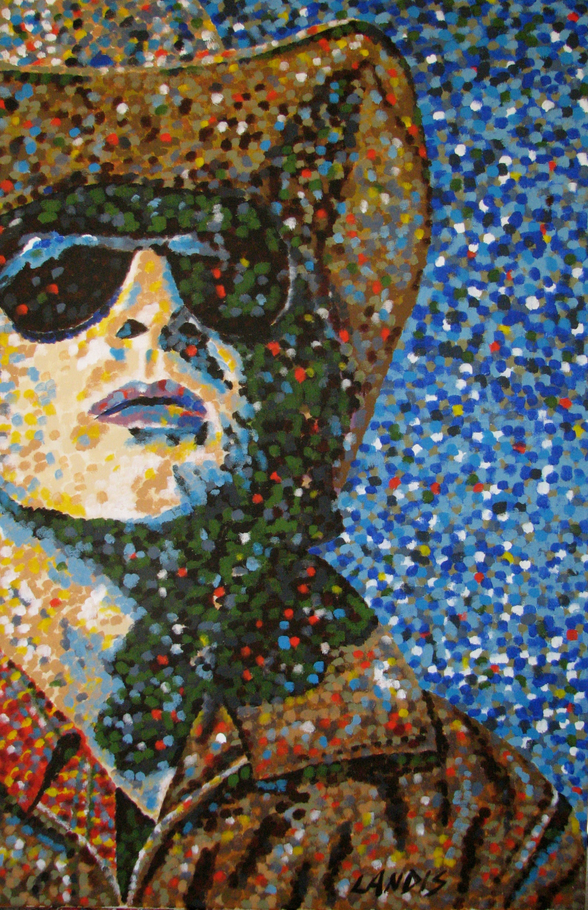
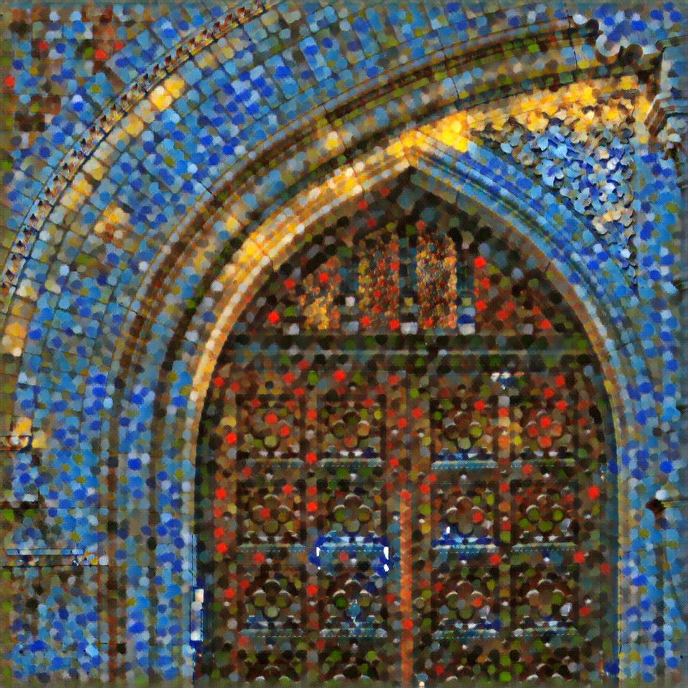

# Fast Neural Style

## Use-cases
This artistic style transfer model mixes the content of an image with the style of another image. Below are examples of style transfer models. Each model transfers a unique style to a photograph of a door arch.  

<p align="center">
  
</p>

|Model        |Mosaic  |Candy  | Rain Princess |Udnie  |Pointilism|
| ------------- | ------------- | ------------- | ------------- | ------------- | ------------- |
|Style Images       |[](images/style_images/mosaic.jpg)| [](images/style_images/candy.jpg)|[](images/style_images/rain_princess.jpg)| [](images/style_images/udnie.jpg)| [](images/style_images/pointilism.jpg)|
|Output Image      |[](images/style_images/amber_mosaic.jpg)| [](images/style_images/amber_candy.jpg)|[](images/style_images/amber_rain_princess.jpg)| [](images/style_images/amber_udnie.jpg)|[](images/style_images/amber_pointilism.jpg)|


## Description
The model uses the method described in [Perceptual Losses for Real-Time Style Transfer and Super-Resolution](https://arxiv.org/abs/1603.08155) along with [Instance Normalization](https://arxiv.org/pdf/1607.08022.pdf).
  

## Model
 |Model        |Download  |MD5 Checksum| Download (with sample test data)|ONNX version|Opset version|
|-------------|:--------------|:--------------|:--------------|:--------------|:--------------|
|Mosaic|[6,571 KB](models/mosaic.onnx)  | 39f0d4d12cf758a7aa31eb150d66244a| [7,162 KB](models/mosaic.tar.gz)|1.5.0|9|
|Candy|[6,571 KB](models/candy.onnx)  | ef6b9b26d2821ee0c082f229b2e6efcd| [7,167 KB](models/candy.tar.gz)|1.5.0|9|
|Rain Princess|[6,571 KB](models/rain_princess.onnx)  | 8253cf9670bb24b38152bd71de5571f1|[7,173 KB](models/rain_princess.tar.gz)|1.5.0|9|
|Udnie|[6,571 KB](models/udnie.onnx)  | f3797cf0dd731c83b307ffa76aed2e67| [7,167 KB](models/udnie.tar.gz)|1.5.0|9|
|Pointilism|[6,571 KB](models/pointilism.onnx)  | e3241660ecd9f14a671d7229bf18cbd1| [7,164 KB](models/pointilism.tar.gz)|1.5.0|9|
<hr>

## Inference
Refer to [fns-pytorch-to-onnx.ipynb](fns-pytorch-to-onnx.ipynb) for detailed preprocessing and postprocessing.

### Input to model
The input to the model are 3-channel RGB images. The images have to be loaded in a range of [0, 255]. If running into memory issues, try resizing the image by increasing the scale number. 

### Preprocessing steps
```
from PIL import Image
import numpy as np

# loading input and resize if needed
image = Image.open("PATH TO IMAGE")
scale = 1 # increase the scale when running into memory issues
image = image.resize((int(image.size[0] / scale), int(image.size[1] / scale)), Image.ANTIALIAS)

# Preprocess image
x = np.array(image).astype('float32')
x = np.transpose(x, [2, 0, 1])
x = np.expand_dims(x, axis=0)
```

### Output of model
The converted ONNX model outputs a NumPy float32 array of shape [1, 3, ‘height’, ‘width’). The height and width of the output image are the same as the height and width of the input image. 

### Postprocessing steps
```
result = np.clip(result, 0, 255)
result = result.transpose(1,2,0).astype("uint8")
img = Image.fromarray(result)
```
<hr>

## Dataset (Train and validation)
The original fast neural style model is from [pytorch/examples/fast_neural_style](https://github.com/pytorch/examples/tree/master/fast_neural_style). All models are trained using the [COCO 2014 Training images dataset](http://cocodataset.org/#download) [80K/13GB]. 
<hr>

## Training
Refer to [pytorch/examples/fast_neural_style](https://github.com/pytorch/examples/tree/master/fast_neural_style) for training details in PyTorch. Refer to [fns-pytorch-to-onnx.ipynb](fns-pytorch-to-onnx.ipynb) for the conversion process.
<hr>


## References
Original style transfer model in PyTorch: <https://github.com/pytorch/examples/tree/master/fast_neural_style>
<hr>

## Contributors
[Jennifer Wang](https://github.com/jennifererwangg)
<hr>

## License
Add license information
<hr>
